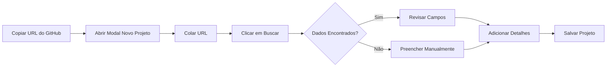

# 🔗 Integração com GitHub API

## Visão Geral

O projeto agora possui integração com a API pública do GitHub, permitindo buscar automaticamente informações de repositórios e preencher os dados do projeto de forma automática.

## Como Usar

### 1. Adicionar Novo Projeto

1. Clique no botão **"+ Novo Projeto"** na página inicial
2. No modal que aparecer, você verá o campo **"URL do Repositório GitHub"** no topo
3. Cole a URL completa do repositório (ex: `https://github.com/usuario/repositorio`)
4. Clique no botão **"Buscar"**

### 2. Preenchimento Automático

Após clicar em "Buscar", o sistema irá:

✅ **Buscar automaticamente:**
- Nome do repositório
- Descrição do projeto
- Linguagens de programação utilizadas
- URL do GitHub Pages (se disponível)
- URL de download do repositório

✅ **Preencher os campos:**
- **Nome do Projeto**: Nome do repositório
- **Descrição**: Descrição do GitHub
- **Linguagens**: Lista de linguagens detectadas
- **URL do Site/Demo**: URL do GitHub Pages (se existir)
- **URL de Download**: Link para baixar o repositório

### 3. Ajustes e Salvamento

Depois que os dados forem preenchidos automaticamente, você pode:
- Revisar e editar qualquer campo
- Adicionar informações adicionais
- Definir a complexidade do projeto
- Marcar como concluído (se aplicável)
- Salvar o projeto

## Exemplos de URLs Suportadas

```
https://github.com/facebook/react
https://github.com/microsoft/vscode
https://github.com/seu-usuario/seu-projeto
github.com/usuario/repo (será normalizada automaticamente)
```

## Informações Técnicas

### API Utilizada

O sistema utiliza a **API REST pública do GitHub**:
- **Endpoint de Repositórios**: `https://api.github.com/repos/{owner}/{repo}`
- **Endpoint de Linguagens**: `https://api.github.com/repos/{owner}/{repo}/languages`

### Dados Buscados

#### 1. Informações do Repositório
```javascript
{
  name: "nome-do-repo",
  description: "Descrição do projeto",
  html_url: "URL do repositório",
  homepage: "URL do site/demo",
  language: "Linguagem principal",
  topics: ["tags", "do", "repo"]
}
```

#### 2. Linguagens de Programação
```javascript
{
  "JavaScript": 50000,
  "CSS": 30000,
  "HTML": 20000
}
```

O sistema calcula automaticamente as porcentagens e lista as principais linguagens.

### Detecção de GitHub Pages

O sistema tenta detectar se o repositório tem GitHub Pages configurado verificando:

1. Campo `homepage` no repositório
2. URL padrão: `https://{owner}.github.io/{repo}`
3. Verificação HTTP se a página existe

## Limitações da API

### Rate Limiting

A API pública do GitHub tem limite de requisições:

- **Sem autenticação**: 60 requisições/hora por IP
- **Com autenticação**: 5.000 requisições/hora

Para uso normal do projeto, o limite de 60/hora é suficiente.

### Mensagens de Erro

O sistema pode exibir os seguintes erros:

| Erro | Causa | Solução |
|------|-------|---------|
| "URL inválida do GitHub" | URL não é do GitHub | Verifique a URL |
| "Repositório não encontrado" | Repo privado ou inexistente | Verifique se o repo é público |
| "Erro ao buscar dados" | Limite de API atingido | Aguarde 1 hora |
| "Por favor, insira uma URL" | Campo vazio | Digite uma URL primeiro |

## Vantagens da Integração

### ✨ Velocidade
- Crie projetos em segundos
- Sem necessidade de copiar/colar manualmente

### ✨ Precisão
- Dados oficiais do GitHub
- Detecção automática de linguagens
- Links sempre atualizados

### ✨ Facilidade
- Interface simples e intuitiva
- Um clique para buscar tudo
- Possibilidade de edição posterior

## Fluxo de Trabalho Recomendado



## Exemplos Práticos

### Exemplo 1: Projeto React
```
URL: https://github.com/facebook/react

Resultado:
✅ Nome: react
✅ Descrição: A JavaScript library for building user interfaces
✅ Linguagens: JavaScript, TypeScript, Flow
✅ Site: https://react.dev/
```

### Exemplo 2: Seu Projeto Pessoal
```
URL: https://github.com/seu-usuario/meu-app

Resultado:
✅ Nome: meu-app
✅ Descrição: Aplicativo web incrível
✅ Linguagens: JavaScript, CSS, HTML
✅ Site: https://seu-usuario.github.io/meu-app
```

## Modo Manual

Se preferir, você ainda pode criar projetos manualmente:

1. Deixe o campo URL vazio
2. Preencha todos os campos manualmente
3. Salve o projeto normalmente

## Privacidade e Segurança

### 🔒 Dados Locais
- Todos os dados são armazenados no `localStorage` do navegador
- Nenhuma informação é enviada para servidores externos
- Você tem controle total dos seus dados

### 🔓 API Pública
- Usa apenas a API pública do GitHub
- Não requer login ou token
- Acessa apenas repositórios públicos

## Troubleshooting

### Problema: "Repositório não encontrado"

**Causas possíveis:**
1. Repositório é privado
2. URL está incorreta
3. Repositório foi deletado

**Solução:** Verifique se o repositório é público e a URL está correta.

### Problema: Botão "Buscar" desabilitado

**Causa:** Campo URL está vazio

**Solução:** Digite uma URL do GitHub primeiro.

### Problema: Dados não aparecem

**Causas possíveis:**
1. Limite de API atingido
2. Problemas de conexão
3. GitHub fora do ar

**Solução:** Aguarde alguns minutos e tente novamente, ou preencha manualmente.

## Código de Exemplo

### Buscar Dados Manualmente (Console)

```javascript
// Importar a função
import { fetchCompleteGitHubInfo } from './utils/github';

// Buscar dados
const dados = await fetchCompleteGitHubInfo('https://github.com/facebook/react');

// Ver resultado
console.log(dados);
/* Output:
{
  name: "react",
  description: "A JavaScript library...",
  languages: "JavaScript, TypeScript",
  repoUrl: "https://github.com/facebook/react",
  webUrl: "https://react.dev",
  downloadUrl: "https://github.com/facebook/react/archive/refs/heads/main.zip"
}
*/
```

## Melhorias Futuras

Possíveis melhorias para a integração:

- [ ] Buscar README do repositório
- [ ] Detectar versão/release mais recente
- [ ] Mostrar estatísticas (stars, forks, issues)
- [ ] Suporte para GitLab e Bitbucket
- [ ] Cache de requisições
- [ ] Modo offline

## Suporte

Se encontrar problemas com a integração GitHub:

1. Verifique a documentação da [GitHub API](https://docs.github.com/rest)
2. Veja os logs no console do navegador (F12)
3. Tente preencher manualmente como alternativa
4. Verifique se sua conexão está funcionando

---

**Nota**: Esta funcionalidade requer conexão com a internet e acesso à API do GitHub. Repositórios privados não podem ser acessados pela API pública.
